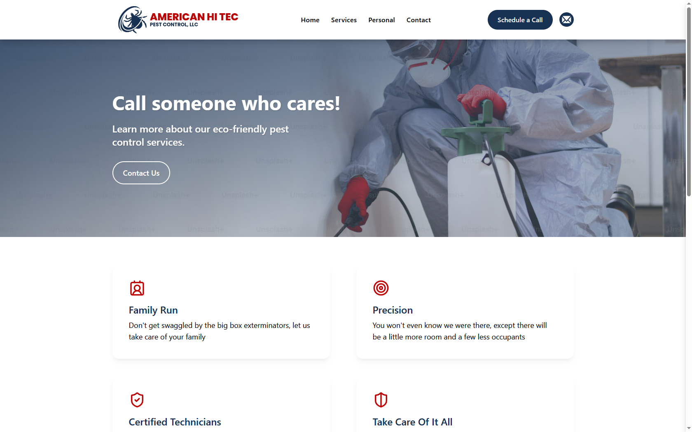

# American Hi Tec Pest Control 🐛

A modern, responsive website for a professional pest management company — built to showcase services, introduce the team, and make it easy for clients to reach out.

---

## 📋 Table of Contents

- [Landing Page](#landing-page)
- [Services](#services)
- [Team Details](#team-details)
- [Contact](#contact)
- [Tech Stack](#tech-stack)
- [License](#license)

---

## 🏠 Landing Page

The home page is the first thing visitors see, and I wanted it to make a strong impression right away. It opens with a bold hero section that communicates what the company does, followed by an about section and a preview of the core services on offer.

- The hero section is designed to grab attention immediately and give visitors a clear sense of who American Hi Tec is
- A services overview section teases the full range of offerings and nudges visitors to explore further

---

## 🪲 Services

This is the heart of the site. I built out a full services listing that covers everything from common household pests to more specialized treatments — each one displayed with a dedicated card, image, and description so visitors know exactly what they're getting.

- Covers a wide range of pest types including spiders, cockroaches, ants, rodents, termites, raccoons, mosquitoes, and more
- Features an embedded termite treatment video and a dedicated section on the company's eco-friendly, sustainable approach

---

## 👥 Team Details

Here I introduced the people behind the business. Visitors can put faces to names and get a feel for who they'd actually be working with — from the founders all the way to the lead technicians.

- Each team member gets their own profile card with their role, a photo, and a short personal description
- The page opens with a dedicated hero section that sets the tone before diving into the individual profiles

---

## 📬 Contact

Getting in touch is as straightforward as it gets. This page brings together all the contact details, a live embedded Google Map showing the company's exact location, and a form so potential clients can send inquiries without ever leaving the site.

- An embedded Google Map pinpoints the office at 1994 Nitsa St, Johns Island, SC 29455
- The contact form lets visitors submit inquiries directly, with toast notifications confirming successful submissions

---

## 🛠 Tech Stack

| Technology | Purpose |
|---|---|
| Next.js 15 | React framework with file-based routing |
| TypeScript | Type safety across the codebase |
| Tailwind CSS | Utility-first responsive styling |
| React Toastify | In-app toast notifications |
| Next Top Loader | Page transition progress bar |
| Google Maps Embed | Interactive location map |
| Vercel | Deployment and hosting |

---

Built with care by <strong>Ashar Meraj</strong> ✦ <a href="https://americanhitecpestcontrol-asharmeraj.vercel.app/">Live Site</a>
